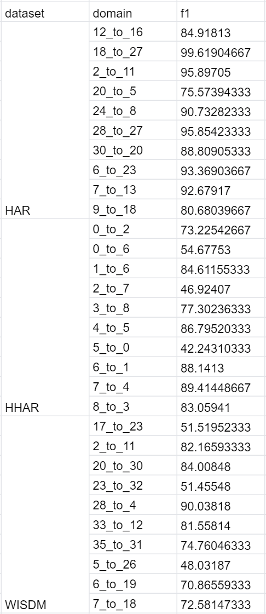

# ([Time Series Domain Adaptation via Sparse Associative Structure Alignment](https://ojs.aaai.org/index.php/AAAI/article/view/16846))[AAAI2021]

## Requirements

- Python  3.7

- Pytorch 1.7

  

## Quick Start

You can run it with the following command.

```
python main.py -cuda_device 0 -dataset HHAR -batch_size 64 -seed 10 -epochs 40
```

## result
#### HAR、HHAR、WISDM

